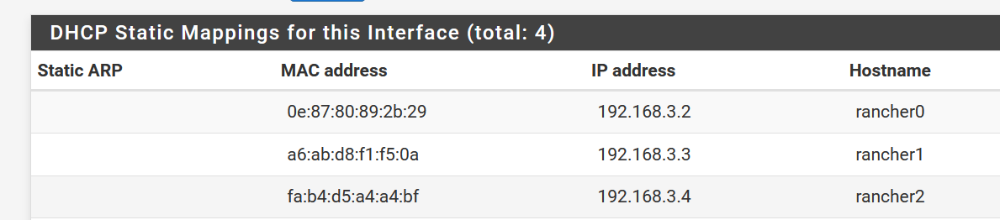
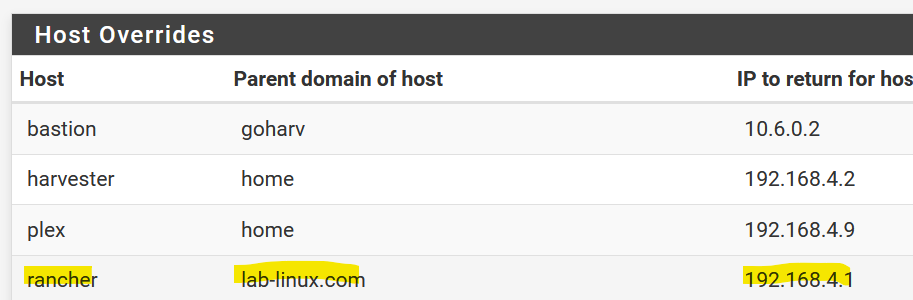
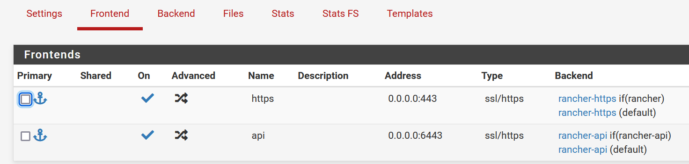
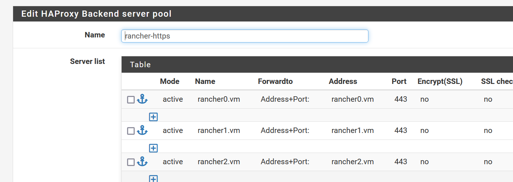
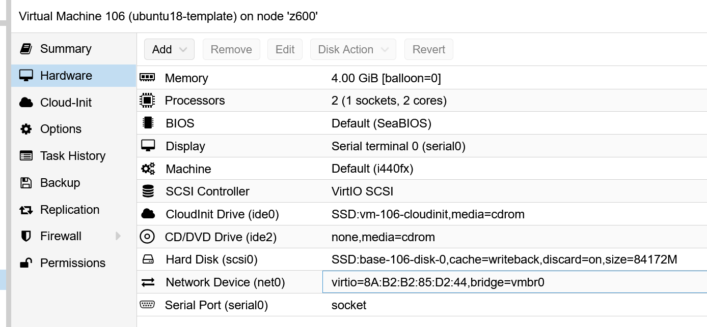
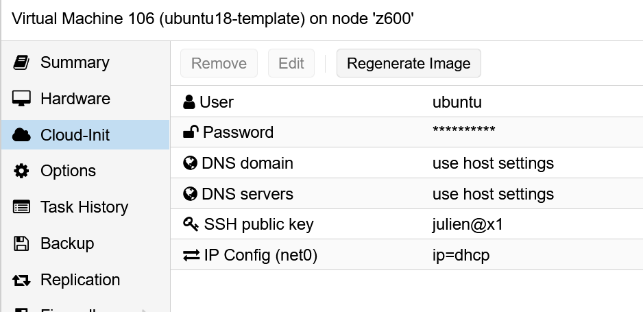

# myRancher
Terraform for Rancher on RKE1 on Proxmox

## Pre-requisites:

- Cloudflare DNS (you could change this easily)
- Proxmox with Ubuntu VM template
- DHCP/DNS and LB4 (ex. HaProxy)
- A way to encrypt your sensitive files (ex. gitcrypt, sop, etc.)

### DHCP client DNS registration (dynamic or static)



### Load balancer layer4 with DNS

1. Create a DNS entry for the rancher domain name pointing to your LB IP

   

2. Configure your LB (ex. HAProxy)

   




### Ubuntu 18 template VM

1. Download the [cloud image](https://cloud-images.ubuntu.com/bionic/current/bionic-server-cloudimg-amd64.img) on your Proxmox host

2. Create a VM in Proxmox, delete the VM disk, and note the VM ID (ex. 106)

3. Create a disk from the cloud image in the Proxmox storage (ex. SSD)

   ```
   qm importdisk 106 ./bionic-server-cloudimg-amd64.img SSD
   ```






## Steps

1. Fork this repository

2. Delete .gitattributes (unless you want to use [gitcrypt](https://github.com/AGWA/git-crypt))

3. Choose your backend (tfstate)

   1. Local = just delete the backend.tf

   2. [Remote](https://www.terraform.io/language/settings/backends/remote) = configure the backend.tf (ex. AzureRM):

      ```
      terraform {
        backend "azurerm" {
          resource_group_name  = "RGNAME"
          storage_account_name = "STORAGE_ACC_NAME"
          container_name       = "CONTAINER_NAME"
          key                  = "rancher.tfstate"
          access_key = "XXXXXXXXXXXXXXXXX"
        }
      }
      ```

4. Replace the variables

   1. variables/encrypted/proxmox.tfvars

      ```
      proxmox_secrets = {
        url = "https://PROXMOX_HOST:8006/api2/json",
        user = "root@pam",
        pass = "PASSWORD",
        ssh_host = "PROXMOX_HOST"
        ssh_user = "root"
      }
      ```

   2. variables/encrypted/rancher.tfvars

      ```
      rancher_bootstrap = "RANCHER_ADMIN_PASSWORD"
      
      cloudflare = {
        zone_id = "ZONE_ID" #Zone ID for your domain name
        ip = "1.2.3.4" #IP for your external public FQDN
        api_token = "XXXXXX" #Token created
        email = "user@test.com" #Cloudflare email account
      }
      
      acme_email = "user@test.com"
      ```

   3. variables/default.tfvars

      ```
      rke_name = "rancher"
      
      rancher = {
        replicas = 3
        domain = "rancher.lab-linux.com"
      }
      
      nodes = {
        masters = {
          count = 3
          cores = 2
          ram_mb = 4069
          storage = "SSD"
          clone = "ubuntu18-template"
          cloud_init_file = "ubuntu18_main.yml"
          name_prefix = "rancher"
          bridge = "vmbr0"
          macaddr = [
            "0e:87:80:89:2b:29",
            "a6:ab:d8:f1:f5:0a",
            "fa:b4:d5:a4:a4:bf"
          ]
          roles = [
            "controlplane",
            "worker",
            "etcd"
          ]
          data_disk = [
            {
              mount = "/mnt/etcd"
              storage = "SSD"
              cache = "unsafe"
              size = 200
            }
          ]
        }
      }
      
      bastion = {}
      
      proxmox = {
        node_name = "z600"
        insecure = true
        ssh_private_key = "~/.ssh/id_rsa"
        ssh_pub_key = "~/.ssh/id_rsa.pub"
        domain_name = "vm"
      }
      ```
